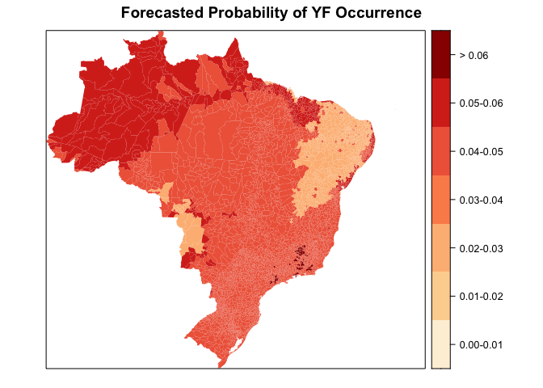
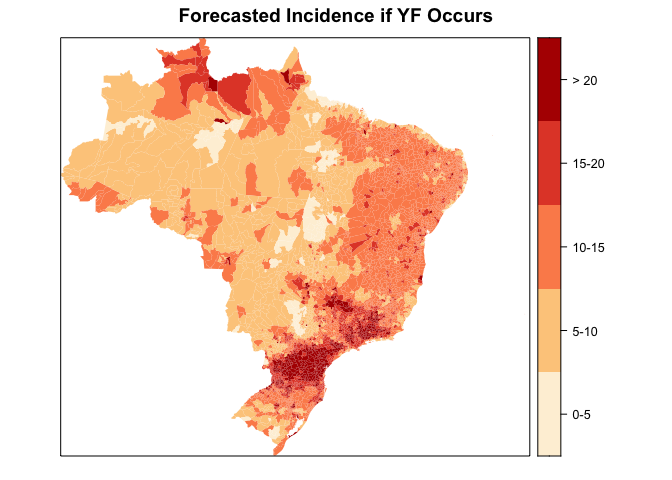

This page shows predictions of future burden, or forecasts, of Yellow Fever across all municipalities of Brazil. 

## Forecast creation

The forecasts created in this document were generated form a statistical model developed through a letter of agreement from the Pan American Health Organization. The model form is a Gamma hurdle model, a two-stage model that produces two forecasted values:

  1. Probability of observing any Yellow Fever cases
  2. Estimated number of cases per 100,000 population under the condition that any cases are seen. 
  
The model uses environmental conditions to produce forecasts for eevery week. The forecasted probability of seeing any Yellow Fever cases uses, as predictors: average temperature two weeks prior, calendar month, previous occurrence of Yellow Fever two weeks prior, and World Wildlife Foundation ecoregions. The forecasted incidence of Yellow Fever, conditioned on seeing any Yellow Fever cases, uses, as predictors: minimum rainfall seven weeks prior, minimum humidity seven weeks prior, previous occurrence of Yellow Fever seven weeks prior, and drainage density. 

The environmental predictors in this model were selected based on forecasting accuracy using weekly Yellow Fever case data collected between December 2016 and March 2018. Model fit was established using data from November 2016 through December 2017, and forecasts of Yellow Fever between January 2018 and March 2018 were compared to observed incidence to assess accuracy of forecasts. 

This model fitting process was also applied to data between January 2000 and November 2016. The results from this model fitting are not used for the forecasts presented here because they represent the time period prior to the recent epidemic. Complete details regarding the model fitting process are currently being prepared for publiction. 

## Yellow Fever forecasts for the week of2-8 April, 2018

# Probability of observing any Yellow Fever cases

Forecasted probabilities of Yellow Fever occurrence for each municipality were produced using information from the week of 19-25 March, 2018.

<!-- -->

# Estimated incidence of Yellow Fever if any cases are observed

Forecasted incidences of Yellow Fever fore each municipality were produced using information from the week of 12-18 February, 2018. The forecasted incidences were estimated separately form the forecasted probabilities of occurrence, so forecasted incidence values are produced even when the probability of occurrence is very low. 

<!-- -->

## Interpretation of results

The first map shows a forecasted probability that any Yellow Fever cases will occur. If Yellow Fever cases were to occur, the second map shows the forecasted number of cases per 100,000 population. 

# The following municipalities have the highest predicted probability of Yellow Fever occurrence:


```
##                            Municipality Probability
## 3627          Rio Claro, Rio de Janeiro        0.51
## 4693                   Aruja, São Paulo        0.51
## 5198   São João da Boa Vista, São Paulo        0.51
## 1599      Barão de Cocais, Minas Gerais        0.50
## 1606       Belo Horizonte, Minas Gerais        0.50
## 1608            Belo Vale, Minas Gerais        0.50
## 1637           Brumadinho, Minas Gerais        0.50
## 1651                Caeté, Minas Gerais        0.50
## 1686             Carandaí, Minas Gerais        0.50
## 1742            Congonhas, Minas Gerais        0.50
## 1745 Conselheiro Lafaiete, Minas Gerais        0.50
## 1747           Consolação, Minas Gerais        0.50
## 1784 Diogo de Vasconcelos, Minas Gerais        0.50
## 1867              Guarani, Minas Gerais        0.50
## 1905              Itabira, Minas Gerais        0.50
## 1907            Itabirito, Minas Gerais        0.50
## 1928            Itaverava, Minas Gerais        0.50
## 1955       João Monlevade, Minas Gerais        0.50
## 1963         Juiz de Fora, Minas Gerais        0.50
## 1971        Lagoa dourada, Minas Gerais        0.50
```

# If any Yellow Fever cases occur, the following municipalities have the highest forecasted incidence:


```
##                                   Municipality Incidence
## 4498                    Laguna, Santa Catarina    420.15
## 4416         Capivari de Baixo, Santa Catarina    416.70
## 2337               Simão Pereira, Minas Gerais    231.38
## 3584 Comendador Levy Gasparian, Rio de Janeiro    156.51
## 1560                   Alpercata, Minas Gerais    116.92
## 3940             Derrubadas, Rio Grande do Sul    104.48
## 4365           Alto Bela Vista, Santa Catarina     66.87
## 1722                     Chiador, Minas Gerais     65.82
## 4445            Formosa do Sul, Santa Catarina     57.57
## 3853       Barra do Guarita, Rio Grande do Sul     48.97
## 4426           Coronel Freitas, Santa Catarina     47.31
## 4553                  Piratuba, Santa Catarina     47.29
## 4632                 Tunápolis, Santa Catarina     45.01
## 4567                  Quilombo, Santa Catarina     42.23
## 2820                      Campo Bonito, Paraná     41.53
## 2845                          Contenda, Paraná     37.72
## 1605               Belmiro Braga, Minas Gerais     37.40
## 2783                         Araucária, Paraná     37.17
## 1046                            Ouvidor, Goiás     37.16
## 3113              São José dos Pinhais, Paraná     36.30
```


